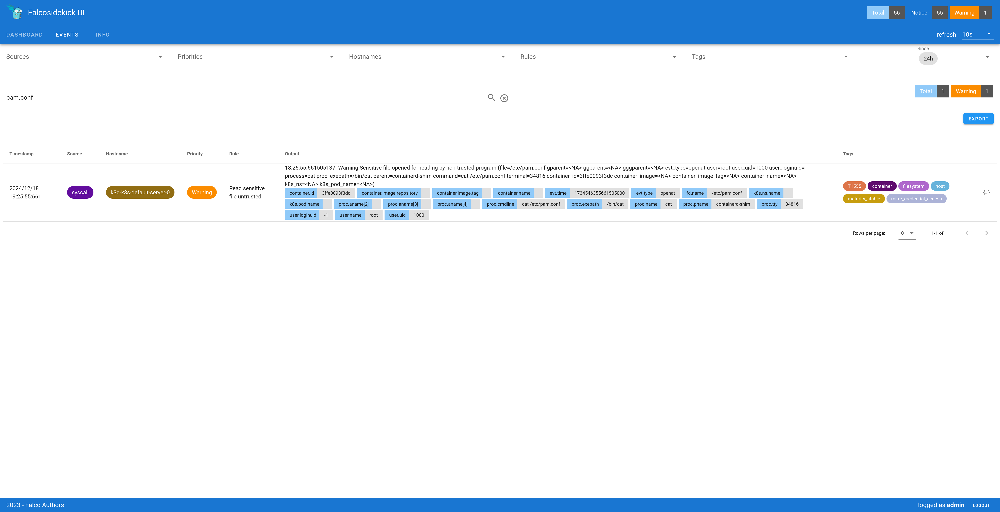
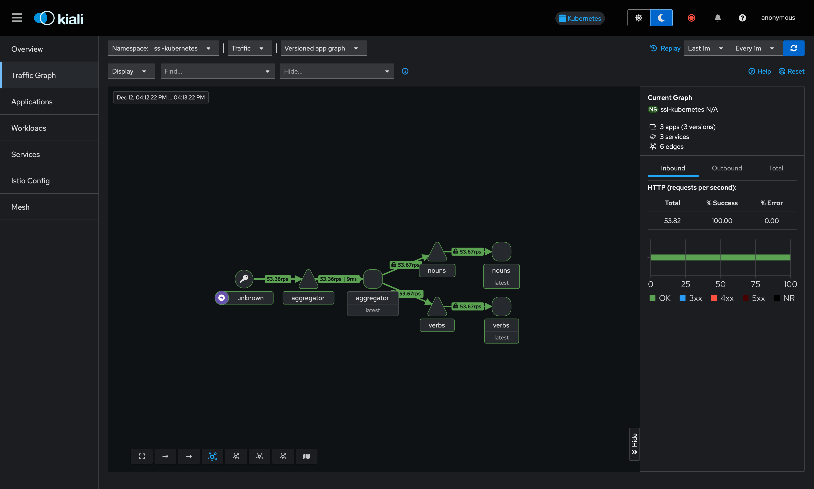

# SSI - Kubernetes security

This project is a deliverable for the SSI course at Polytech Montpellier, 5th
year of DO.

## Deploy to k3d

Deployment of this project has been tested on a Kubernetes cluster managed by
k3d.

### Prerequisites

First, [install k3d](https://k3d.io/stable/#installation) and spin up a new
cluster with:

```sh
k3d cluster create -p "8081:80@loadbalancer"
```

This will create a single-node local cluster that maps `localhost:8081` to the
port 80 of the load balancer in the cluster. If port 8081 is already used on
your host machine, you can change it to another port.

Then, multiple services will need to be installed in the cluster as part of the
security hardening:

- [Kyverno](https://kyverno.io/docs/installation/methods/)
- [Falco](https://falco.org/docs/getting-started/falco-kubernetes-quickstart/)
- [Istio](https://istio.io/latest/docs/setup/install/helm/) 

In a nutshell:

```sh
# Kyverno
helm repo add kyverno https://kyverno.github.io/kyverno/
helm repo update
helm install kyverno kyverno/kyverno -n kyverno --create-namespace

# Falco
helm repo add falcosecurity https://falcosecurity.github.io/charts
helm repo update
helm install --replace falco --namespace falco --create-namespace --set tty=true --set falcosidekick.enabled=true --set falcosidekick.webui.enabled=true falcosecurity/falco

# Istio
helm repo add istio https://istio-release.storage.googleapis.com/charts
helm repo update
helm install istio-base istio/base -n istio-system --set defaultRevision=default --create-namespace
helm install istiod istio/istiod -n istio-system --wait
kubectl apply -f https://raw.githubusercontent.com/istio/istio/release-1.24/samples/addons/kiali.yaml
kubectl apply -f https://raw.githubusercontent.com/istio/istio/release-1.24/samples/addons/prometheus.yaml
```

### Deploy the project

The project will be deployed to the cluster using
[kustomize](https://kustomize.io/).

To deploy this project to your prepared k3d cluster, simply go to the
[`kubernetes/local-ssi/`](./kubernetes/local-ssi) directory in a shell and run
`kubectl apply -k .`.

If everything went well, you should be able to request the aggregator service
by running `curl http://localhost:8081/`. You should see a JSON response with a
`sentence` key containing a random sentence.

## Security measures

### Kyverno

#### Add Default securityContext - Mutation policy

This policy is defined in
[`kubernetes/local-ssi/kyverno/add-securitycontext.yml`](kubernetes/local-ssi/kyverno/add-securitycontext.yml).

This adds the following configuration on the pod security context:
- `runAsNonRoot: true`: requires the pod containers to run as non-root users
- `runAsUser: 1000`: runs container processes with user ID 1000
- `runAsGroup: 3000`: runs container processes with primary group ID 3000
- `fsGroup: 2000`: the owner group ID of files in mounted volumes is 2000

This adds the following configuration on the pod containers security context:
- `allowPrivilegeEscalation: false`: forbids processes to gain more privileges
  than their parent processes (for example, setuid/setgid binaries)
- `readOnlyRootFilesystem: true`: mounts the root container filesystem as
  read-only
- `capabilities: drop: - ALL`: drops all Linux capabilities (privileged
  operations)

Those are default values for the security context, and will _not_ override
values that would be defined in the resource itself.

**How to test:** You can make sure that the `securityContext` is set correctly
on one of the app pods:

```sh
$ kubectl get pods -n ssi-kubernetes -l 'app.kubernetes.io/name=aggregator' -o yaml | grep -A 4 securityContext
      securityContext:
        allowPrivilegeEscalation: false
        capabilities:
          drop:
          - ALL
--
    securityContext:
      fsGroup: 2000
      runAsGroup: 3000
      runAsNonRoot: true
      runAsUser: 1000
```

Alternatively, you can, for instance, make sure that the container of an app
deployment is running as the specified user/group:

```sh
$ kubectl exec deploy/aggregator -n ssi-kubernetes -- id
uid=1000 gid=3000 groups=3000,2000
```

#### Add Istio labels - Mutation policy

This policy is defined in
[`kubernetes/local-ssi/kyverno/add-istio-labels.yml`](kubernetes/local-ssi/kyverno/add-istio-labels.yml).

This adds two labels to the pods that are necessary for Istio to work
correctly:

- `app`: copied from the `app.kubernetes.io/name` label of the pod
- `version`: copied from either image tag or digest of the first container in
  the pod

**How to test:** You can check that the app pods contain those two labels:

```sh
$ kubectl get pods -n ssi-kubernetes --show-labels             
NAME                          READY   STATUS    RESTARTS   AGE    LABELS
aggregator-85886f7d5c-jl5rg   2/2     Running   0          5m7s   app.kubernetes.io/name=aggregator,app.kubernetes.io/part-of=ssi-kubernetes,app=aggregator,pod-template-hash=85886f7d5c,security.istio.io/tlsMode=istio,service.istio.io/canonical-name=aggregator,service.istio.io/canonical-revision=latest,version=latest
nouns-fc9978b9-llv7w          2/2     Running   0          5m6s   app.kubernetes.io/name=nouns,app.kubernetes.io/part-of=ssi-kubernetes,app=nouns,pod-template-hash=fc9978b9,security.istio.io/tlsMode=istio,service.istio.io/canonical-name=nouns,service.istio.io/canonical-revision=latest,version=latest
verbs-5f9bb479b9-p5wlm        2/2     Running   0          5m5s   app.kubernetes.io/name=verbs,app.kubernetes.io/part-of=ssi-kubernetes,app=verbs,pod-template-hash=5f9bb479b9,security.istio.io/tlsMode=istio,service.istio.io/canonical-name=verbs,service.istio.io/canonical-revision=latest,version=latest
```

As you can see, all three pods contains the `app` and `version` labels.

#### Verify Image - Admission policy

This policy is defined in
[`kubernetes/local-ssi/kyverno/verify-image-signature.yml`](kubernetes/local-ssi/kyverno/verify-image-signature.yml).

After the container image is built [in the
CI](https://github.com/Kuruyia/ssi-kubernetes/blob/2196e44dff3e865d02c3c52d6820814080ecb5aa/.github/workflows/on_push_main.yml#L94-L105),
it is signed with [cosign](https://github.com/sigstore/cosign) using a private
key supplied as a GitHub Actions secret.

Kyverno then verifies the signature of all container images whose name begins
with `ghcr.io/kuruyia/ssi-kubernetes/` against the corresponding public key,
and rejects the pod if the signature is invalid.

**How to test:** You can modify the public key given to Kyverno to an invalid
one, and check that Kyverno prevents the pods from being run because they can
no longer be verified:

```sh
# In the `kubernetes/local-ssi/` directory
sed -i '' 's/MFkw/MFaa/g' kyverno/verify-image-signature.yml
kubectl apply -k .
kubectl delete pods -n ssi-kubernetes --all
```

Then, check the events in the app namespace with `kubectl events -n
ssi-kubernetes`:

```sh
[...]
2s (x15 over 90s)   Warning   FailedCreate       ReplicaSet/verbs-774478894f        Error creating: admission webhook "mutate.kyverno.svc-fail" denied the request: 

resource Pod/ssi-kubernetes/ was blocked due to the following policies 

verify-image:
  verify-image: 'failed to verify image ghcr.io/kuruyia/ssi-kubernetes/words:latest:
    .attestors[0].entries[0].keys: failed to load public key from PEM: pem to public
    key: asn1: structure error: tags don''t match (16 vs {class:2 tag:26 length:19
    isCompound:false}) {optional:false explicit:false application:false private:false
    defaultValue:<nil> tag:<nil> stringType:0 timeType:0 set:false omitEmpty:false}
    AlgorithmIdentifier @2'
```

As you can see, the pods are being blocked by Kyverno. You can also see that
there are no pods in the app namespace:

```sh
$ kubectl get pods -n ssi-kubernetes
No resources found in ssi-kubernetes namespace.
```

To revert the changes:

```sh
# In the `kubernetes/local-ssi/` directory
git restore .
kubectl apply -k .
```

#### Require resource requests - Admission policy

This policy is defined in
[`kubernetes/local-ssi/kyverno/require-requests.yml`](kubernetes/local-ssi/kyverno/require-requests.yml).

Any pod that contains container which do not set resource requests will be
prevented from running.

**How to test:** You can try to patch one of the deployments of this app to
remove the resource requests:

```sh
$ kubectl patch deploy aggregator -n ssi-kubernetes -p '{"spec":{"template":{"spec":{"containers":[{"name":"aggregator", "resources":{"requests":null}}]}}}}'
Error from server: admission webhook "validate.kyverno.svc-fail" denied the request: 

resource Deployment/ssi-kubernetes/aggregator was blocked due to the following policies 

require-requests:
  autogen-validate-resources: 'validation error: CPU and memory resource requests
    are required. rule autogen-validate-resources failed at path /spec/template/spec/containers/0/resources/requests/'
```

As you can see, Kyverno blocks the change due to the missing resource requests.

#### Require liveness or readiness probes - Admission policy

This policy is defined in
[`kubernetes/local-ssi/kyverno/require-liveness-readiness.yml`](kubernetes/local-ssi/kyverno/require-liveness-readiness.yml).

Any pod that contains container which do not set either liveness or readiness
probes will be prevented from running.

**How to test:** You can try to patch one of the deployments of this app to
remove the probes:

```sh
$ kubectl patch deploy aggregator -n ssi-kubernetes -p '{"spec":{"template":{"spec":{"containers":[{"name":"aggregator", "livenessProbe":null, "readinessProbe":null}]}}}}'
Error from server: admission webhook "validate.kyverno.svc-fail" denied the request: 

resource Deployment/ssi-kubernetes/aggregator was blocked due to the following policies 

require-liveness-readiness:
  autogen-validate-probes: 'validation failure: Liveness or readiness probes are required
    for all containers.'
```

As you can see, Kyverno blocks the change due to the missing liveness probe.

### Falco

Falco is installed in the `falco` namespace with the
[Falcosidekick](https://github.com/falcosecurity/falcosidekick) and the
[Falcosidekick-ui](https://github.com/falcosecurity/falcosidekick-ui)
components, which can be used to push Falco events to various external services
(such as Slack) and show those events on a web interface.

To see Falco in action, we can first trigger one of Falco's predefined rule by
reading a sensitive file inside of one of the application container: `kubectl
exec -it $(kubectl get pods --selector=app=aggregator -n ssi-kubernetes -o
name) -n ssi-kubernetes -- cat /etc/pam.conf`.

Then, we can port forward the web interface with `kubectl port-forward
svc/falco-falcosidekick-ui 2802:2802 -n falco` and going to `localhost:2802` in
a web browser. The default credentials are `admin`/`admin`.

Going into the "Events" tab, and searching for "pam.conf", the sensitive file
we just read, we can see the event that we just triggered:



### Istio

Istio is installed in the `istio-system` namespace with the [Kiali web
interface](https://istio.io/latest/docs/ops/integrations/kiali/) and a
[Prometheus TSDB](https://istio.io/latest/docs/ops/integrations/prometheus/)
that records metrics about apps that uses the service mesh.

The `ssi-kubernetes` namespace that contains the pods of this project [is
labeled with
`istio-injection=enabled`](https://github.com/Kuruyia/ssi-kubernetes/blob/19e92c2a632596f9dffb8f85d92c9ae37cb916c6/kubernetes/local-ssi/ns.yml#L6),
which tells Istio to inject a sidecar proxy container in each pod deployed in
this namespace. Also, [a Kyverno policy](#Add-Istio-labels---Mutation-policy)
adds the `app` and `version` labels to the pods for Istio to add contextual
information to the collected metrics and telemetry.

To see Istio in action, you can connect to the Kiali web interface by port
forwarding its service with `kubectl port-forward svc/kiali 20001:20001 -n
istio-system` and going to `localhost:20001` in a web browser.

You can generate some traffic in the cluster by requesting the aggregator
service at `localhost:8081`, and checking the Traffic Graph in Kiali:



As you can see, mTLS is enabled by default in Istio between the aggregator
service and the nouns/verbs services.
